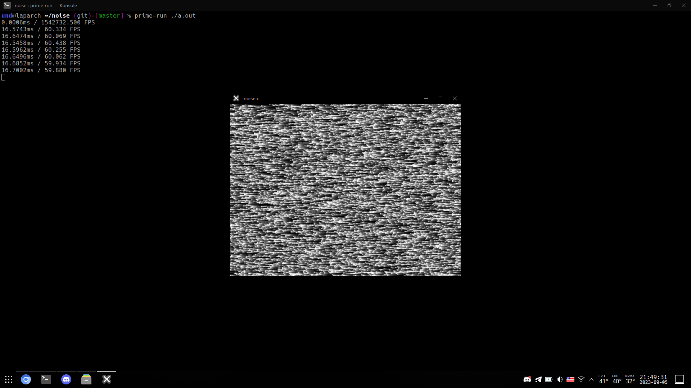
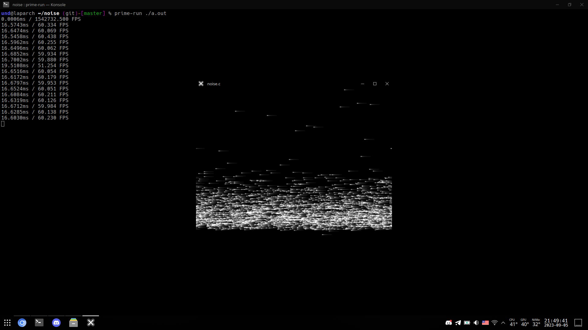
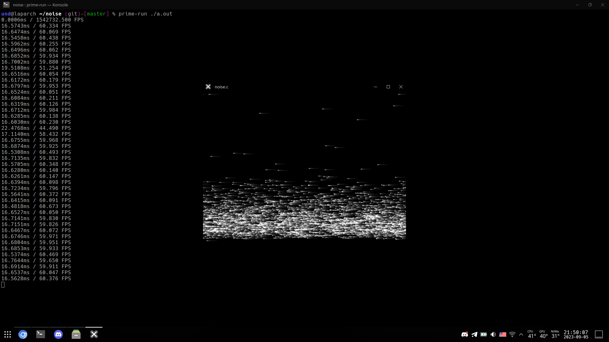
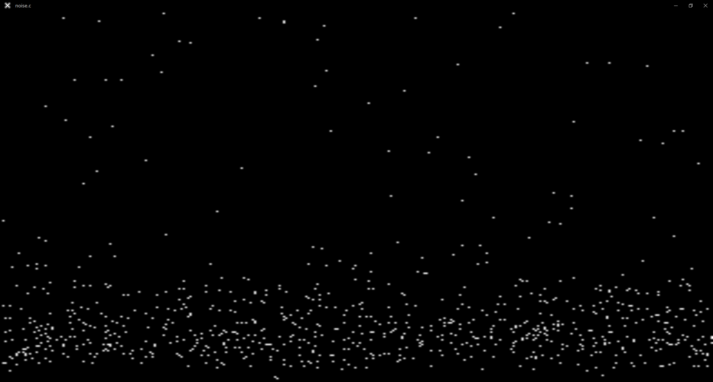
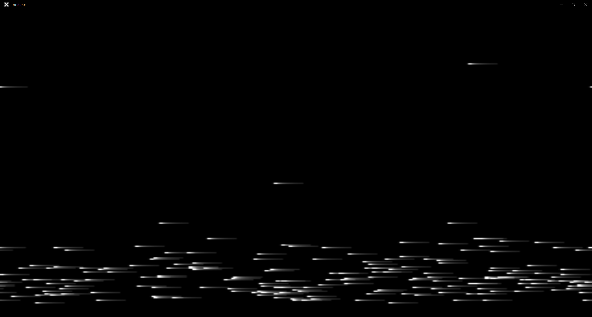

# VHS noise
A C and OpenGL 3.3 core program that generates
authentic-ish approximate VHS noise.  

  
  
  

# Basics
VHS noise originates from physical imperfections
of the analog format:  
1. It can be a speck or dirt on the tape or the heads.
2. A random particle screwing up field on the tape.
3. General EM noiseness around heads or tape.

As a result, if we don't account for the head assembly
rotating (_insert a free bird rat joke here_), the picture
would look like this:  
  

With added horizontal directional blur (in other words skewing
the noise texture a little bit to add "tails") the final picture
would look close to the real VHS noise:  
  

# App controls
* Hold MOUSE1 (left) and drag left-to-right to adjust overall noise scale
* Hold MOUSE2 (right) and drag left-to-right to adjust bottom VHS-like noise scale
* Press MOUSE3 (middle) to reset values to default.

# TODO
* Add CRT burn-in or something
