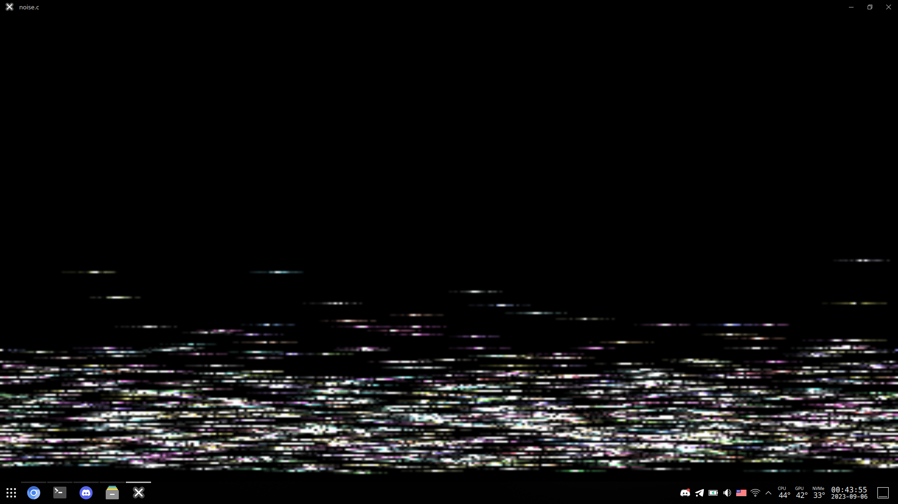
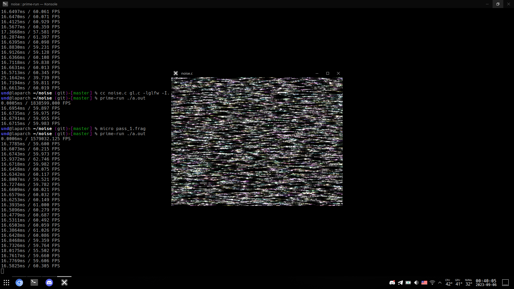

# VHS noise
A C and OpenGL 3.3 core program that generates
authentic-ish approximate VHS noise.  

So far it's the most authentic video noise generator
I've touched that works realtime (I might've not touched
enough video noise generators though).  

  
  
  




* [Video demo](https://youtu.be/Z30cKoFvha4)
* Initial shader on [Shadertoy](https://www.shadertoy.com/view/ctSfRm)

# Basics
VHS noise originates from physical imperfections
of the analog format:  
1. It can be a speck or dirt on the tape or the heads.
2. A random particle screwing up field on the tape.
3. General EM noiseness around heads or tape.

As a result, if we don't account for the head assembly
rotating (_insert a free bird rat joke here_), the picture
would look like this:  
  

With added horizontal directional blur (in other words skewing
the noise texture a little bit to add "tails") the final picture
would look close to the real VHS noise:  
  

# Color noise
With some more randomness in the way you define the speck color
and the amount of blur you can get closer to the real thing:  


# Requirements
* A GPU
* GLFW (`pacman -S glfw-x11` or `pacman -S glfw-wayland` or something else I don't care)

# Building
```
cc gl.c noise.c -oa.out -lglfw -I.
```

# Running
```
./a.out
```

Or, with NVIDIA prime (laptop moment):  
```
prime-run ./a.out
```

# App controls
* Hold MOUSE1 (left) and drag left-to-right to adjust overall noise scale
* Hold MOUSE2 (right) and drag left-to-right to adjust bottom VHS-like noise scale
* Press MOUSE3 (middle) to reset values to default.
